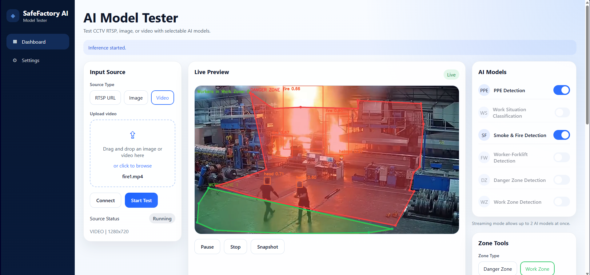

# SafeFactory AI

<p align="center">
  <strong>Web-based industrial safety AI model tester for RTSP, image, and video sources.</strong>
</p>

<p align="center">
  Django REST backend · React dashboard · Ultralytics YOLO inference · Polygon zone analytics
</p>

<p align="center">
  
  
  
  
  
</p>

---

## Overview

SafeFactory AI is a lightweight testing platform for validating industrial safety computer vision models from a single dashboard. It supports RTSP streams, uploaded images, and uploaded videos, then runs only the selected AI modules with real-time overlays, zone logic, and structured safety events.

The current repository is built as a practical MVP for model evaluation, internal demos, and workflow validation before larger production deployment.

## Preview

Use this section for your GitHub visuals.

Suggested assets:

- `docs/assets/dashboard-overview.png`
- `docs/assets/live-preview.gif`
- `docs/assets/results-table.png`

Example markup to enable after you add files:

```md

```

```md

```

## Key Features

- Unified web UI for testing RTSP, image, and video sources
- Selectable AI modules with streaming-safe model limits
- Live annotated preview served directly from Django
- Worker-forklift proximity monitoring
- Danger zone and work zone polygon analytics
- Worker counting inside work zones
- Snapshot capture of annotated frames
- Paginated event history focused on actionable safety events
- Duplicate event suppression with worker-aware cooldown logic
- CUDA-enabled inference path when GPU is available

## Supported Detection Modules

| Module | Purpose | Notes |
| --- | --- | --- |
| PPE Detection | Detect PPE-related objects and generate missing helmet events | Repository event flow focuses on actionable PPE issues rather than raw helmet/vest detections |
| Work Situation Classification | Detect unsafe or meaningful work-situation states | Example: worker without helmet, unsafe material throwing |
| Smoke & Fire Detection | Detect smoke and fire events | Non-actionable classes are filtered out of results |
| Worker-Forklift Detection | Detect forklift risk near workers | Automatically enables human keypoint logic internally |
| Danger Zone Detection | Trigger event when worker enters red polygon zone | Automatically enables human keypoint logic internally |
| Work Zone Detection | Count workers inside green polygon zone | Automatically enables human keypoint logic internally |

## How It Works

1. Connect a source from RTSP, image upload, or video upload.
2. Choose the AI modules to activate.
3. Start inference from the dashboard.
4. The backend loads only the required models.
5. For forklift and zone analytics, pose/keypoint logic is injected automatically behind the scenes.
6. The frontend renders the live frame, overlays, zones, counts, and paginated event history.

## Architecture

### Backend

- **Framework:** Django + Django REST Framework
- **Inference runtime:** Python, OpenCV, Ultralytics YOLO
- **Session model:** single active inference session
- **Preview transport:** MJPEG stream for RTSP/video, static annotated frame for image mode
- **Persistence:** SQLite for sources, zones, snapshots, and event records

Main backend responsibilities:

- source validation and connection
- inference session lifecycle
- model loading and GPU routing
- event generation and event deduplication
- polygon zone storage and reconstruction
- snapshot export
- frontend build serving through Django

### Frontend

- **Framework:** React + Vite
- **UI scope:** dashboard, settings, results table, polygon drawing tools
- **Polling strategy:** results/status polling with separate MJPEG preview

Main frontend responsibilities:

- source input workflow
- model selection
- live preview rendering
- polygon drawing and saving
- event browsing with pagination
- runtime/settings visibility

## Repository Layout

```text
SafeFactory AI/
├─ backend/
│  ├─ apps/inference/
│  │  ├─ services/
│  │  ├─ models.py
│  │  ├─ serializers.py
│  │  ├─ urls.py
│  │  └─ views.py
│  ├─ safefactory/
│  └─ manage.py
├─ frontend/
│  ├─ src/
│  │  ├─ components/
│  │  ├─ pages/
│  │  ├─ services/
│  │  └─ styles/
│  ├─ dist/
│  └─ package.json
├─ ai_models/                # local model weights, ignored by git
├─ monitoring_worker_forklift.py
├─ spatial_zone_monitor_demo.py
├─ requirements.txt
└─ README.md
```

## Model Weights

This repository intentionally does **not** track trained weight files in Git.

Expected local model paths:

- `ai_models/ppe.pt`
- `ai_models/work_situation.pt`
- `ai_models/fire.pt`
- `ai_models/forklift.pt`
- `ai_models/yolo11s-pose.pt`

If your filenames differ, update:

- [`backend/safefactory/settings.py`](backend/safefactory/settings.py)

## Quick Start

### 1. Clone the repository

```bash
git clone <your-repo-url>
cd "SafeFactory AI"
```

### 2. Install backend dependencies

```bash
pip install -r requirements.txt
```

### 3. Build the frontend

```bash
cd frontend
npm.cmd install
npm.cmd run build
cd ..
```

### 4. Run Django

```bash
cd backend
python manage.py migrate
python manage.py runserver
```

### 5. Open the app

```text
http://127.0.0.1:8000/
```

## Development Mode

If you want to run the frontend separately during UI development:

### Backend

```bash
cd backend
python manage.py runserver
```

### Frontend

```bash
cd frontend
npm.cmd install
npm.cmd run dev
```

Frontend dev server default:

```text
http://127.0.0.1:5173/
```

## Dashboard Workflow

### Input Source

- Choose `RTSP URL`, `Image`, or `Video`
- Provide the RTSP string or upload a file
- Click `Connect`

### AI Models

- Enable the modules you want to test
- Streaming mode is capped to **2 primary AI modules at once** for stability
- Worker keypoint logic is auto-enabled internally for:
  - Worker-Forklift Detection
  - Danger Zone Detection
  - Work Zone Detection

### Zone Tools

- Select `Danger Zone` or `Work Zone`
- Draw polygon points on the preview
- Double-click to finish the polygon
- Save zones per connected source

### Detection Results

- Shows the latest **actionable events**
- Paginated with **10 events per page**
- Duplicate events are suppressed using worker-aware cooldown logic

## Event Logic

The system is designed to show useful safety events rather than every raw detection box.

Examples:

- `Missing Helmet`
- `Worker Without Helmet`
- `Unsafe Material Throwing`
- `Smoke Detected`
- `Fire Detected`
- `Forklift Near Worker`
- `Worker in Danger Zone`
- `N Workers in Work Zone`

Repeated events for the same tracked subject are suppressed for a cooldown window to reduce noise in the dashboard.

## API Summary

| Method | Endpoint | Purpose |
| --- | --- | --- |
| `POST` | `/api/source/connect/` | Validate and connect RTSP/image/video source |
| `POST` | `/api/inference/start/` | Start inference session with selected models |
| `POST` | `/api/inference/pause/` | Pause active inference |
| `POST` | `/api/inference/resume/` | Resume active inference |
| `POST` | `/api/inference/stop/` | Stop current session |
| `GET` | `/api/inference/frame/` | Fetch latest annotated frame |
| `GET` | `/api/inference/stream/` | MJPEG preview stream |
| `GET` | `/api/inference/results/` | Fetch paginated event results and status |
| `POST` | `/api/zones/save/` | Save polygon zone |
| `GET` | `/api/zones/` | Load saved zones |
| `POST` | `/api/snapshot/` | Save current annotated frame |
| `GET` | `/api/settings/` | Runtime settings, model paths, and device info |

## Testing

### Backend

```bash
cd backend
python manage.py test
python manage.py check
```

### Frontend

```bash
cd frontend
npm.cmd test
npm.cmd run build
```

## Performance Notes

- GPU inference is used automatically when CUDA is available.
- Streaming mode is intentionally limited to two active AI modules at once.
- Event spam is reduced with cooldown-based deduplication.
- Image mode runs once and keeps the annotated result available for review and snapshotting.

## GitHub Notes

- Model weights are ignored by `.gitignore`
- Frontend build output is ignored by `.gitignore`
- Local database, media, and environment files are ignored by `.gitignore`

Recommended additions for a stronger repository presentation:

- `docs/assets/dashboard-overview.png`
- `docs/assets/live-preview.gif`
- `docs/assets/zone-tools.png`
- `docs/assets/results-table.png`
- `LICENSE`
- `CONTRIBUTING.md`

## Status

This repository currently represents a working MVP focused on:

- internal evaluation
- model behavior testing
- UI validation
- safety event review

It is a strong base for adding authentication, multi-session orchestration, persistent configuration management, model versioning, and deployment automation later.
